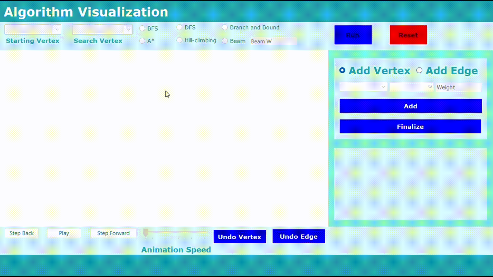
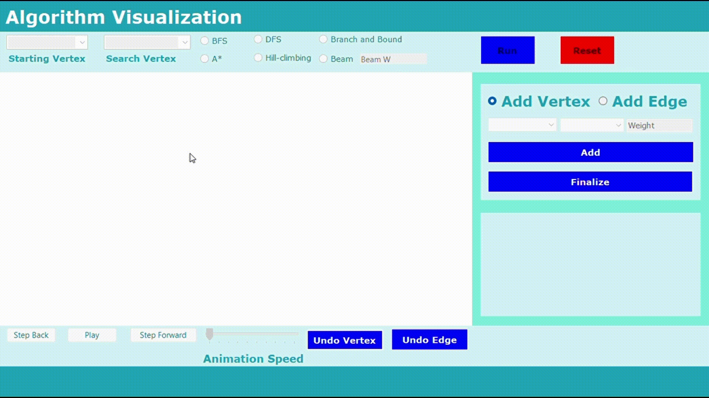
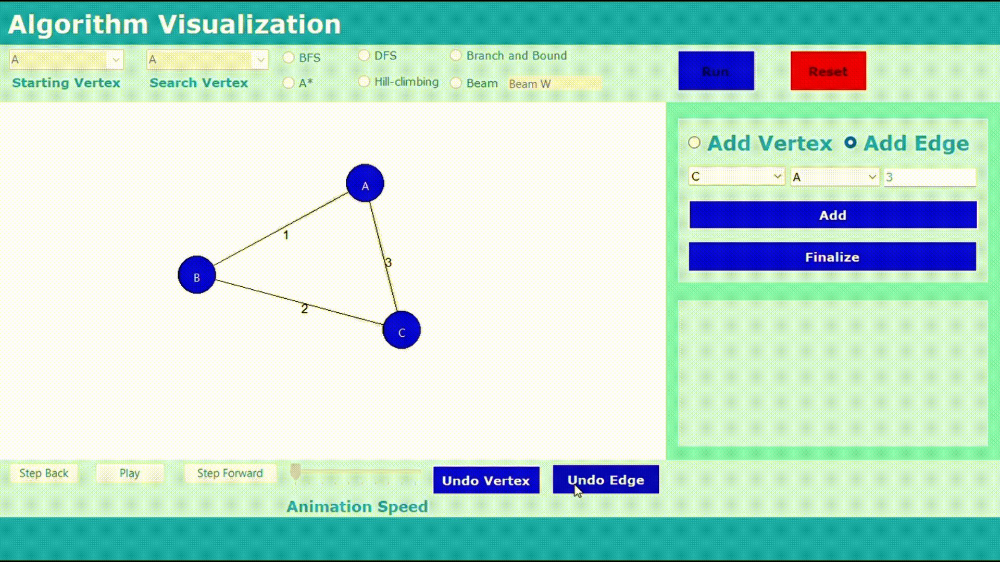
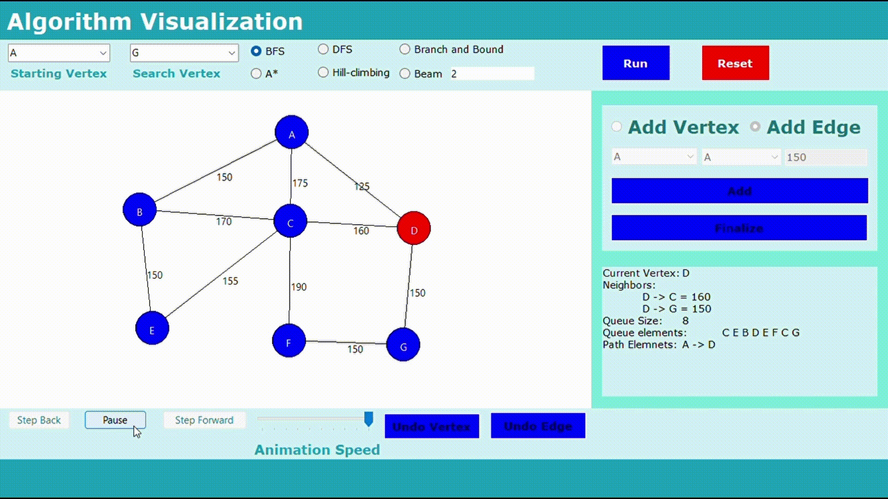
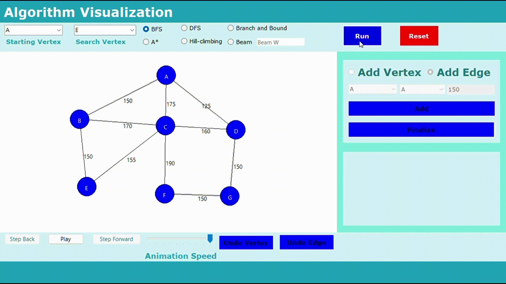
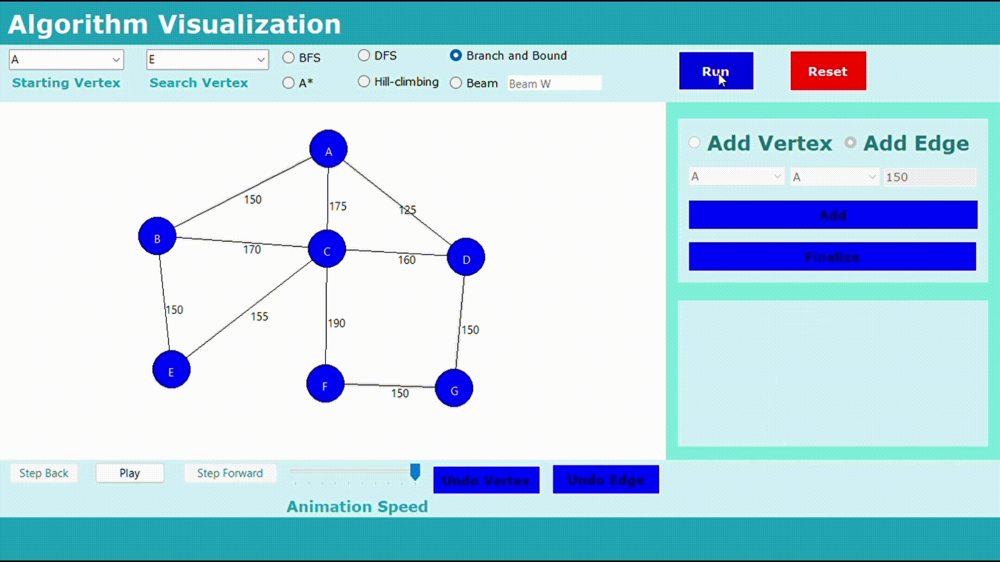
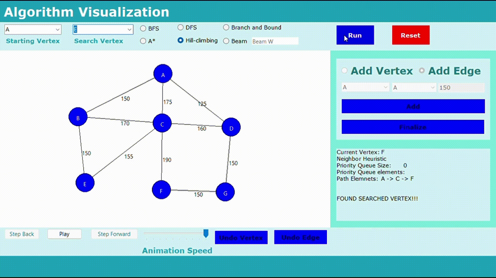

# Searching Algorithm Visualization

## Overview

The **Searching Algorithm Visualization** app provides an interactive platform to visualize six popular searching algorithms. These algorithms include Breadth-First Search (BFS), Depth-First Search (DFS), A Star, Branch and Bound, Beam Search, and Hill Climbing. The application allows users to gain insights into the mechanics of these algorithms through a dynamic and intuitive visual representation.

## Features

1. **Add Vertex**
   - Clicking on the picture box will add a vertex to the visualization. This feature allows users to build the graph by interactively adding vertices.
  
     

2. **Add Edge**
   - Connect given vertices by creating edges. This feature enables users to establish connections between vertices, defining the structure of the graph.
  
     

3. **Undo Vertex**
   - Undo the addition of the last vertex. This feature provides flexibility in modifying the graph structure by reverting the most recent vertex addition.
    
4. **Undo Edge**
   - Remove the last connection added between vertices. Users can refine the graph by undoing the latest edge creation.
    
5. **Pause, Play, Step Back, and Step Forward**
   - **Pause:** Halt the animation to closely inspect the current state.
   - **Play:** Resume the animation to observe the searching algorithm in action.
   - **Step Back:** Navigate to the previous highlighted vertex in the algorithm's execution sequence.
   - **Step Forward:** Move to the next highlighted vertex in the algorithm's execution sequence.
   

## Visualization
- `1.` **BFS**
  
- `2.` **DFS**
  
- `3.` **Branch and Bound**
  
- `4.` **Hill Climbing**
  
- `5.` **Beam Search**
  
- `6.` **A Star**
  

  ## **Clone Repository**
  ```bash
  git clone https://github.com/clydexavier/Lab-4-Search-Algorithms
  ```
